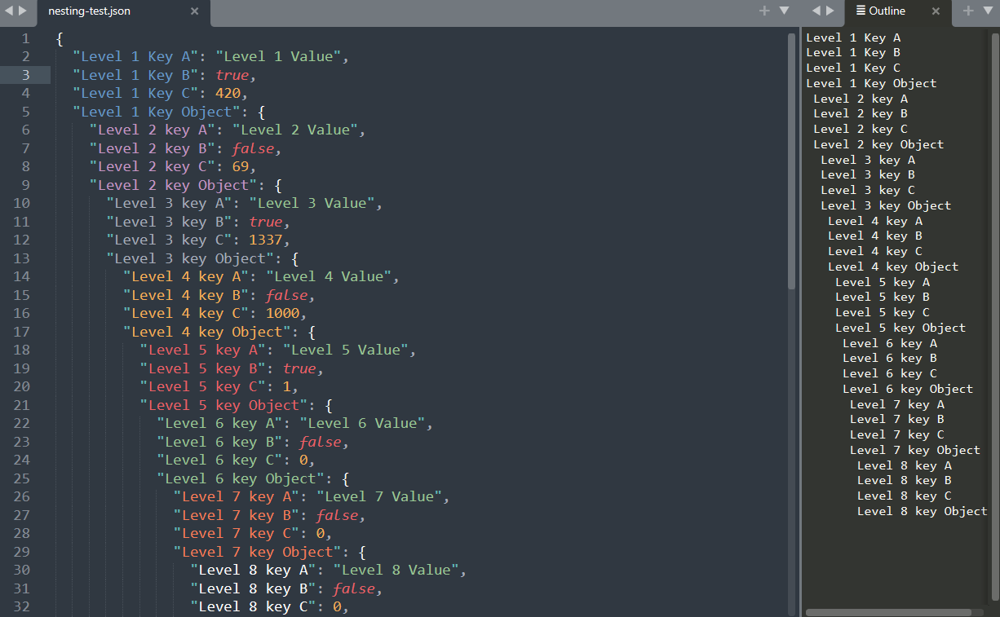
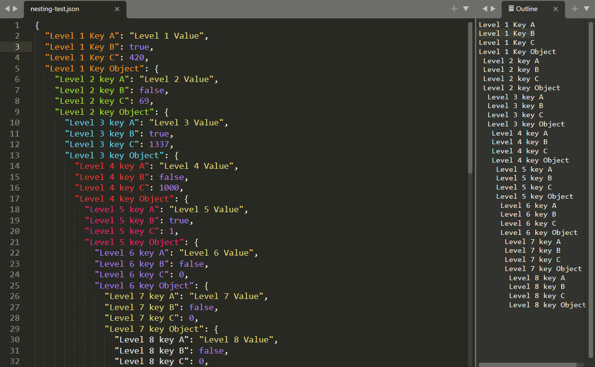
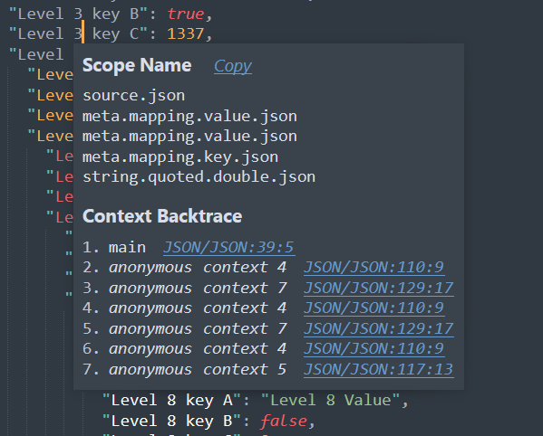
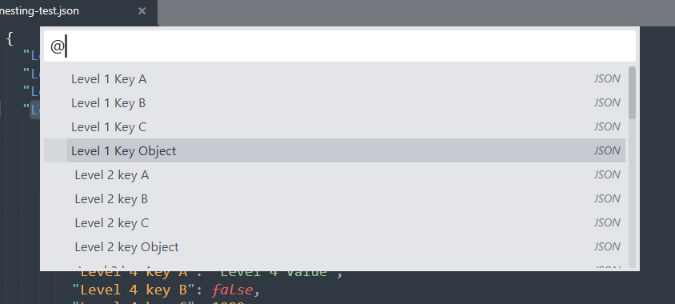

   
  
# Json Symbols And Color Syntax JSCS
[JSCS](https://github.com/Monox18/JsonSymbolsAndColorSyntax/) add symbols and colorful syntax to JSON files in Sublime Text 3 and 4 (ST).

## Coloring Syntax support
JSCS supports syntax coloring for the default themes `Mariana` and `Monokai` with up to 10 levels of nesting. Keys are colored according to nested level, while values remain with default colors. 

Rather than creating a new syntax color, JSCS makes use of [Sublime Text configuration system](https://www.sublimetext.com/docs/settings.html). The syntax coloring is done in `<theme-name>.sublime-color-scheme`. You can select the theme via `Preferences > Select Color Scheme...`. You can add changes in you User folder to extend both the Default and JSCS configurations of the current Color Scheme via `Preferences > Customize Color Scheme`. More information in [ST Color Scheme](https://www.sublimetext.com/docs/color_schemes.html)

The inheritance is as follow:
1) `Packages/Color Scheme - Default/Mariana.sublime-color-scheme` (Default ST)
2) `Packages/JSON Symbols and Color Syntax/Mariana.sublime-color-scheme` (this repository)
3) `Packages/User/Mariana.sublime-color-scheme` (your configuration)

## Scopes
Scopes are a method to split a script into lexical units. The purpose is to asign a definition to each unit in a script file. To display any unit, put your cursor anywhere in the open file and go to `Tools > Developer > Show Scope Name` or press `ctrl+shift+alt+p`. Scopes enable ST to understand the script, parse it, apply color and so on.

JSCS doesn't add new scopes neither extends the default scopes found in the YAML file `Packages/JSON/JSON.sublime-syntax`. That is entirely done and maintained by ST. Only the default scopes defined there are used by JSCS. This ensures that 1) JSCS works with .json Syntax by default (without creating a new syntax deinition), and 2) JSCS will remain compatible with future updates.

If interested into extending `JSON.sublime-syntax` or similar, you can use [PackageResourceViewer](https://github.com/skuroda/PackageResourceViewer) to explore its contents, extract it and modify it. Learn more about [Scopes](https://www.sublimetext.com/docs/scope_naming.html) and [Selectors](https://www.sublimetext.com/docs/selectors.html).

## Symbol Navigation
It's a tecnique to [jump to class and funcion definitios](https://docs.sublimetext.io/reference/symbols.html). It's quite common in Javascript and other programming languages but not so much in data exchange formats. 

By default, ST doesn't push any kind of JSON symbols `Goto > Go to Symbol` or `ctrl+R`. JSCS pushes keys as symbols in `.tmPreferences` to enable symbol navigation. 

Also, other plugins that make use of symbols will be ale to render and interact them. Which bring us to the next section: Outline package. 

## Json outline for better code navigation
I recommend you the [Outline package](https://github.com/warmdev/SublimeOutline) which displays an interactive table of contents. It allows code navigation, function navigation, symbol navigation, whatever you want to call it. A clickable list of idented keys will be shown. Additionally, JSCS adds one space per nested level with the `symbolTransformation` property to display identation. 

## Just a simple everyday quality of life package :)

...and an excuse to start using git ☕

 
