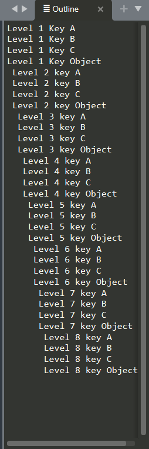

  
# Json Symbols and Color Syntax JSCS
JSCS add symbols and colorful syntax to JSON files in Sublime Text 3 and 4 (ST). All built-in color themes in ST4 are supported: `Breakers`, `Celeste`, `Mariana`, `Monokai` and `Sixteen`. Also support for 3rd party custom themes can be added. See [Supporting Custom Color Themes](#supporting-for-custom-color-themes)

## Installation

The best way to install JSON Symbols and Color Syntax is through [Package Manager](https://packagecontrol.io/). Accesible via `Preferences > Package Control` or `ctrl+shift+p`.

Alternatively, you can download the latest code into your Sublime Text `Packages` directory, either by cloning the repository or by downloading the [GitHub repository of JSCS](https://github.com/Monox18/JsonSymbolsAndColorSyntax).

## Coloring Syntax support
JSCS supports syntax coloring for the default themes `Mariana` and `Monokai` with up to 10 levels of nesting. Keys are colored according to nested level, while values remain with default colors. 

Rather than creating a new syntax color, JSCS makes use of [Sublime Text configuration system](https://www.sublimetext.com/docs/settings.html). The syntax coloring is done in `<theme-name>.sublime-color-scheme`. You can select the theme via `Preferences > Select Color Scheme...`. You can add changes in you User folder to extend both the Default and JSCS configurations of the current Color Scheme via `Preferences > Customize Color Scheme`. More information in [ST Color Scheme](https://www.sublimetext.com/docs/color_schemes.html)

The inheritance is as follow:
1) `Packages/Color Scheme - Default/Mariana.sublime-color-scheme` (Default ST)
2) `Packages/JSON Symbols and Color Syntax/Mariana.sublime-color-scheme` (this repository)
3) `Packages/User/Mariana.sublime-color-scheme` (your configuration)

## Scopes
Scopes are a method to split a script into lexical units. The purpose is to asign a definition to each unit in a script file. To display any unit, put your cursor anywhere in the open file and go to `Tools > Developer > Show Scope Name` or press `ctrl+shift+alt+p`. Scopes enable ST to understand the script, parse it, apply color and so on.

JSCS doesn't add new scopes neither extends the default scopes found in the YAML file `Packages/JSON/JSON.sublime-syntax`. That is entirely done and maintained by ST. Only the default scopes defined there are used by JSCS. This ensures that 1) JSCS works with .json Syntax by default (without creating a new syntax deinition), and 2) JSCS will remain compatible with future updates.

If interested into extending `JSON.sublime-syntax` or similar, you can use [PackageResourceViewer](https://github.com/skuroda/PackageResourceViewer) to explore its contents, extract it and modify it. Learn more about [Scopes](https://www.sublimetext.com/docs/scope_naming.html) and [Selectors](https://www.sublimetext.com/docs/selectors.html).

## Symbol Navigation
It's a tecnique to [jump to class and funcion definitios](https://docs.sublimetext.io/reference/symbols.html). It's quite common in Javascript and other programming languages but not so much in data exchange formats. 

By default, ST doesn't push any kind of JSON symbols `Goto > Go to Symbol` or `ctrl+R`. JSCS pushes keys as symbols in `.tmPreferences` to enable symbol navigation. 

Also, other plugins that make use of symbols will be ale to render and interact them. Which bring us to the next section: Outline package. 

## Json outline for better code navigation
I recommend you the [Outline package](https://github.com/warmdev/SublimeOutline) which displays an interactive table of contents. It allows code navigation, function navigation, symbol navigation, whatever you want to call it. A clickable list of idented keys will be shown. Additionally, JSCS adds one space per nested level with the `symbolTransformation` property to display identation. 

## Inspired by: 
* [JSON Key-Value](https://github.com/aurule/json-kv) which creates a new syntax definition requiring you to use `JSON Key Value` syntax.
* [Monokai JSON+](https://github.com/ColibriApps/MonokaiJsonPlus) which creates a new Color Scheme requiring you to use `Monokai JSON+` color scheme. 

On contrary, JSCS merely extends ST current syntax definitions and color schemes to remain compatible with other plugins. Thus, no new syntax neither new color themes are installed.

## Supporting Custom Color Themes
You can eaaasily extend a 3rd party syntax to include JSCS along with your custom color theme. As long as they have extended (not replaced) ST4 Json syntax do this:
1) Make a copy of `Monokai.sublime-color-scheme`. Paste it in the JSCS package folder or your `Packages/User` folder.
2) Change its name to the name of the custom color theme you are using. The name must match for ST to detect it and apply the changes. I.e if you installed `Monokai++` custom theme then the new file name would be `Monokai++.sublime-color-scheme`
3) Edit the `"foreground": "var(purple)"` properties to match those used by your theme. To find the variables used by your current them go to `Preferences > Customize Color Theme`. Use any of the values in the key `"variables"`. In ST, file modifications are live. Each time you save, you will instantly see changes in your open ST json files.
4) Boom done. 
5) Optionally, you can pull request that file to this repo and I will merge it :)

## Just a simple everyday quality of life package :)

...and an excuse to start using git ☕

